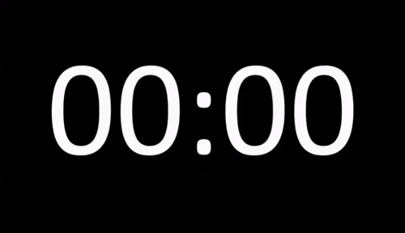
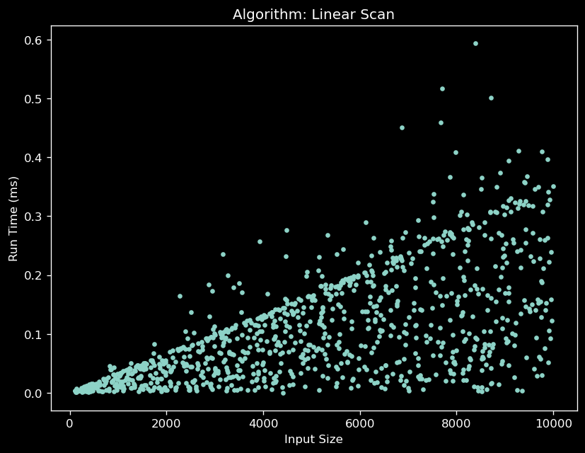
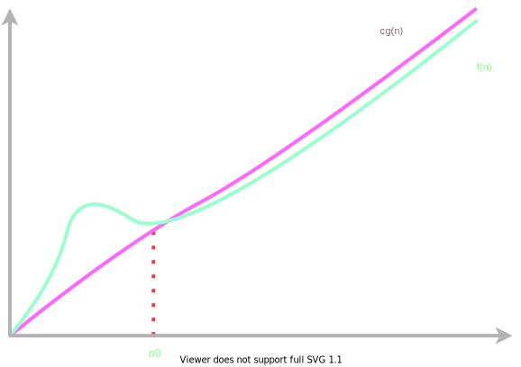
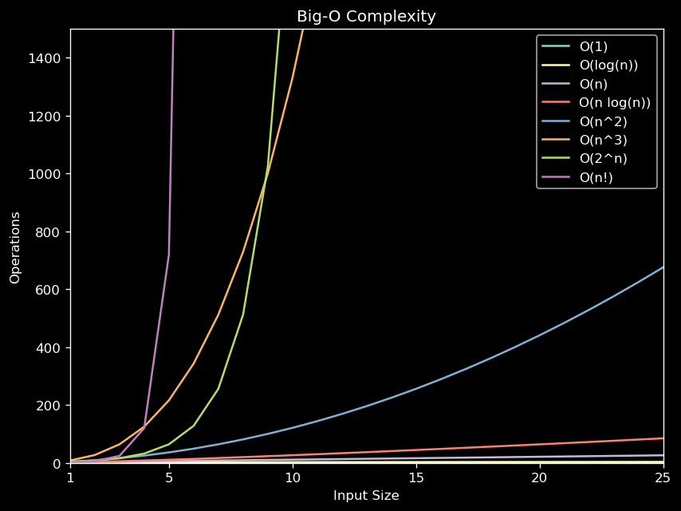

# Analysis of Algorithms
<!-- .slide: data-auto-animate -->

Dr. David Greenwood

david.greenwood@uea.ac.uk

Room SCI 2.16a

Note: introductions - hello
House keeping, what is going on this week...
Please take notes! I don't like busy slides much...

--

# Analysis of Algorithms 
<!-- .slide: data-auto-animate -->

#### Part 1

### A Gentle Introduction

--

## Reading

- Data Structures and Algorithms
    - Michael T. Goodrich
    - Versions available for Python and Java.
- Introduction to Algorithms 
    - Thomas H. Cormen et. al.
    - A more formal resource

Note: Take care with online resources, that they are up to date and accurate

--

## Synopsis

* Defining and Developing Algorithms
<!-- .element: class="fragment" -->
* Experimental Analysis
<!-- .element: class="fragment" -->
* Analytic Characterisation
<!-- .element: class="fragment" -->
* Big $\mathcal{O}$ notation
<!-- .element: class="fragment" -->

Note: So this is what I intend to to cover in this lecture.
Some of these may be entirely new topics. Don't worry, we will go slowly.

---

<!-- .slide: data-auto-animate -->
## Goal

**formally** define an algorithm

Note: we want to be certain what we mean when we discuss algorithms.

--

<!-- .slide: data-auto-animate -->
## Goal

understand how we *compare* the

performance of **different** algorithms

Note: the same problem could be solved by different algorithms, how do we compare? 

--

<!-- .slide: data-auto-animate -->
## Goal

Counting *fundamental operations*

Performance for different *cases*
<!-- .element: class="fragment" -->

*Run-time complexity* as a function of problem size
<!-- .element: class="fragment" -->

Note: this is how we answer the question - How do we compare?

--

## How Good is an Algorithm?
<!-- .element: class="fragment" -->

> in plain English...

Note: Knowing how to compare algorithms is important so you can make sure you are 
using the correct one for the job at hand!

It would be very useful information if you could tell that sorting 
algorithm a is expected to take x amount of time to sort products on your
website vs. algorithm b that is expected to take x*x

--

<!-- .slide: data-auto-animate -->

## Time and Space

Time complexity ; How *long* does it take to run?
<!-- .element: class="fragment" -->

Space complexity ; How much *memory* does it need?
<!-- .element: class="fragment" -->

Note: *not* the theory of relativity...
We only really have two concerns with the performance of an algorithm.

--

<!-- .slide: data-auto-animate -->

## Time and Space

Often a trade-off!

Note:
Typically this is a trade-off, where algorithms that reduce time complexity 
may increase the space complexity, and vice versa.

--

## Time complexity

We will focus on how long an algorithm takes to run!

Note: In your next year - you will explore analysis in more depth!

---

<!-- .slide: data-auto-animate -->
## What is an Algorithm?

An algorithm is a finite **sequence** of unambiguous **instructions** for 
solving a **problem**, that will always **terminate**.

Note: A reminder of a formal definition of an algorithm.
Emphasise, always correct, and always terminate.
Etymology <https://www.britannica.com/biography/al-Khwarizmi>

Al-Khwārizmī, 8th century Baghdad...

--

<!-- .slide: data-auto-animate -->
## What is an Algorithm?

Algorithms are *developed* through a process of *translation*, 
from an *informal* description to a *formal* description

Note: we don't always choose - we have to develop! 

--

**Formal** descriptions are written in **pseudo code**

--

## Developing Algorithms

### **Specification**
<!-- .element: class="fragment" -->

### **Inputs**
<!-- .element: class="fragment" -->

### **Outputs**
<!-- .element: class="fragment" -->

Note: Three things we need to know? 
What should it do? Feasible inputs, outputs or effect?

--

<!-- .slide: data-auto-animate -->

#### Developing Algorithms 

> The first level of understanding is the human one. 
> You should be able to explain in plain terms how the algorithm works.

Note: real back of envelope stuff - nothing to do with computers necessarily.

--

<!-- .slide: data-auto-animate -->

#### Developing Algorithms

> The second level is a more detailed, but still informal description, 
> that breaks the problem down into sub-problems.

Note: some algorithms may deal with problems 
too trivial to significantly break down.

--

<!-- .slide: data-auto-animate -->

#### Developing Algorithms

> The third level is a detailed pseudo code description, with all stages 
> refined until the description is unambiguous.

--

<!-- .slide: data-auto-animate -->

#### Developing Algorithms

### *There is often more than one solution!*

Note: It's worth stating...there may be more than one solution!
And, some problems may have no solution... we wont concern ourselves with those!

--

## Writing Pseudocode

There is no universally accepted pseudocode.
<!-- .element: class="fragment" -->

It *should* be language independent.
<!-- .element: class="fragment" -->

Note: We will relax that rule to enable runnable code in the labs!
I don't want you to learn another language...

--

<div class="left-center">

`pseudocode`

```text
scanArray(array[1..n], key): boolean
    for i := 1 to n
        if key == array[i]
        return true
    return false
```

</div> 
<div class="right-center">

`python`

```python
def scan_values(key, values):
    for value in values:
        if value == key:
            return True
    return False

```

</div>

Note: an example of pseudo code, compared with python.
Some very high level languages are quite close to English, 
and therefore quite descriptive.

---

## Case Study

--

### Linear Scan Algorithm

1. *Specification*
    - return true if key is in array of $n$ values, else false
<!-- .element: class="fragment" -->

2. *Input*
    - array of size $n$,  element key
<!-- .element: class="fragment" -->

3. *Output*
    - boolean - true if key is found in array, else false
<!-- .element: class="fragment" -->


Note: What do I mean by values? What do I mean by a key?
We will just use integers for our example, but items could be any type.
Anything for which we could make a comparison, and say true or false.

--

### Informal Algorithm

See if we can find an item in a list that matches a key...

--

### Informal Algorithm

- Step through all items.
     - If we find a match, return true
<!-- .element: class="fragment" -->
     - Return false if not found.
<!-- .element: class="fragment" -->

Note: breaking it down a bit

--

### Formal Algorithm

<div style="font-size: 1.85em;">

```text
scanArray(array[1..n], key): boolean
    for i := 1 to n
        if key == array[i]
        return true
    return false
```

</div>

note: Here is some pseudo code. 
So, we hold on to the idea that we index an array in order, to find an item.

---

# Question?

## How long will this algorithm take to run?
<!-- .element: class="fragment" -->

Note: So, the BIG question is... how long does it take to run...

--

<!-- .slide: data-auto-animate -->

## Experimental Approach



Note: Run the code, and use a stop watch...
Seems a reasonable approach... let's do it!

--

<!-- .slide: data-auto-animate -->

## Experimental Approach

* A large sample of inputs.
<!-- .element: class="fragment" -->
* System time for each run.
<!-- .element: class="fragment" -->
* Plot the results.
<!-- .element: class="fragment" -->

Note: so this is what we need for an experiment
we wont actually use a stop watch - we will use the system clock.

--



Note: What can we say about this plot? 
How will this algorithm perform on your machine?

--

<!-- .slide: data-auto-animate -->
### Challenges of Experimental Analysis

The machine the algorithm is being run on.
<!-- .element: class="fragment" -->

Multiple runs on the same hardware may be different.
<!-- .element: class="fragment" -->

There may be other processes running.
<!-- .element: class="fragment" -->

Note: there are a number of machine dependent considerations

--

<!-- .slide: data-auto-animate -->
### Challenges of Experimental Analysis

A limited set of test inputs.
<!-- .element: class="fragment" -->

An algorithm must be fully implemented.
<!-- .element: class="fragment" -->

Note:  
Experiments can be done only on a limited set of test inputs
 (and these inputs may be important).

An algorithm must be fully implemented in order to 
study its running time experimentally. Otherwise, how do we test it?

---

<!-- .slide: data-auto-animate -->
### Moving Beyond Experimental Analysis

--

<!-- .slide: data-auto-animate -->
### Moving Beyond Experimental Analysis

Take an approach that allows us to...

* gain independence of hardware
<!-- .element: class="fragment" -->
* no need for implementation
<!-- .element: class="fragment" -->
* all possible inputs
<!-- .element: class="fragment" -->

--

<!-- .slide: data-auto-animate -->
### Time complexity

<div style="font-size: 1.85em;">

```text
scanArray(array[1..n], key): boolean
    for i := 1 to n
        if key == array[i]
        return true
    return false
```

</div>

Note: let's just remind ourselves of the pseudo code...

--

<!-- .slide: data-auto-animate -->
### Time complexity

1. The size of the input array (i.e. size of $n$).
2. Where element `key` is within the array (if at all).

Note: we want to define the time complexity using only these factors.
We then use this information to give a hardware independent analysis

--

<!-- .slide: data-auto-animate -->
### Time complexity

We count the **fundamental operations** that are performed.

>These will be the same over multiple runs on any hardware 
>thus making comparisons between algorithms more informative.
<!-- .element: class="fragment" -->

Note: this is the big key point of analysis. COUNTING FUNDAMENTAL operations.

--

### operations

<div style="font-size: 1.2em">

```text
loop:
    initialisation: i := 1
    comparison: i <= n
    update: i := i + 1

inside loop:
    key == array[i]
    return

after loop:
    return
```

</div>

Note: let's look at the operations...

--

To reiterate, we assess the time an algorithm takes

i.e. its *time complexity*

by counting the number of operations it performs.

--

We could include all operations...

but many are one-off and incidental to the overall runtime.
<!-- .element: class="fragment" -->

Note: I have already forgotten what all those operations were...
But, I want you to bear in mind that there are other operations involved.

--

Therefore we choose a *fundamental operation* and **characterise** the 
algorithm by counting these fundamental operations.

Note: the time taken to execute a fundamental operation must 
be (approximately) the same whenever that operation is executed 
on any instance on the domain of an algorithm. Independent of the machine...

--

<!-- .slide: data-auto-animate -->
#### Which operations do we count?

<div style="font-size: 1.2em">

```text[ | 7]
loop:
    initialisation: i := 1
    comparison: i <= n
    update: i := i + 1

inside loop:
    key == array[i]
    return

after loop:
    return
```

</div>

Note: count this one

--

<!-- .slide: data-auto-animate -->
#### Which operations do we count?

we will only count the operation at the heart of the algorithm.

---

<!-- .slide: data-auto-animate -->
### Fundamental Operation

## `key == array[i]`

Note: this is a comparison... 
a comparison is often the fundamental operation in many 
sorting and searching algorithms

--

<!-- .slide: data-auto-animate -->
### Fundamental Operation

## How many times is the fundamental operation performed?

Note: we have defined the fundamental op, now how do we count...

--

<!-- .slide: data-auto-animate -->
### Fundamental Operation

**Two** things to consider...

**Size** of the input array
<!-- .element: class="fragment" -->

**Where** is ` key ` in the array
<!-- .element: class="fragment" -->


Note:
Remember I said we have 2 things to consider?
We want to find the number of ops for any value of n
e.g. not 6 or 12, but relative (e.g. n operations, or n*n, etc.)

There are different cases. 
This algorithm would be much faster if e is the first element 
(best case scenario is 1 operation) 
than if e isn’t in the array at all (worst case scenario is n operations)

--

<!-- .slide: data-auto-animate -->
### Counting Fundamental Operations

Where ` key ` is in the array decides the **case**.
<!-- .element: class="fragment" -->

--

<!-- .slide: data-auto-animate -->
### Counting Fundamental Operations

operation   | count      | case
----------- | ---------- | --------
`key == array[1]`  | op is called once      | **best** case
`key == array[2]`  | op is called twice     |
 |...| 
`key == array[n]`  | op is called $n$ times | **worst** case

--

Generally, we assume the **worst** case.

`key == array[i]` is performed **$n$** times.
<!-- .element: class="fragment" -->


Note:
Unless specifically asked to consider a different case... 
It makes sense to prepare for the worst so you know your algorithm 
will at least always work to a certain level even under the most 
pessimistic circumstances.

So in this case, the worst case is that if key==a[i] will be performed n times

--

### Why Assume the Worst Case?

> In good weather, a commercial airliner requires 150,000$l$ of fuel to cross the Atlantic ocean.
<!-- .element: class="fragment" -->

> In poor weather, it requires 200,000$l$ of fuel.
<!-- .element: class="fragment" -->

> In *most* circumstances it is unacceptable for an algorithm to fail.
<!-- .element: class="fragment" -->

Note: We can compare different cases, but prepare for the worst 
to guarantee the minimum that the algorithm can achieve.

---

## What actually **is** the worst case?

For all possible outcomes...
<!-- .element: class="fragment" -->

which outcome results in the most work being carried out?
<!-- .element: class="fragment" -->

note: this is a decent definition of the worst case

--

<!-- .slide: data-auto-animate -->

### Linear Scan Time Complexity Function

## $$ t(n) = n $$

$t(n)$ is called the run time complexity function
<!-- .element: class="fragment" -->

Note: this is a measure of time not in seconds, 
but in terms of number of operations! 
I've ignore all incidental operations, like setting up the array.

--

<!-- .slide: data-auto-animate -->
## $$ t(n) = n $$

We have **characterised** our function for the *worst* case.

Note: We have ignored constants from incidental operations.

--

<!-- .slide: data-auto-animate -->
## $$ t(n) = n $$

We call this a *linear* time algorithm.

We say this is *order* **$n$**, or...
<!-- .element: class="fragment" -->

### $$\mathcal{O}(n)$$
<!-- .element: class="fragment" -->

Note: this is a pretty big concept. Anyone heard of this before?

--

<!-- .slide: data-auto-animate -->
### Big $\mathcal{O}$ Notation

Note: this is a pretty big concept. Anyone heard of this before?
let's look at some formal definitions...

--

<!-- .slide: data-auto-animate -->
### Big $\mathcal{O}$ Notation

...is used to describe an *asymptotic* upper bound

> An *asymptote* is a line that a curve approaches, as it heads towards infinity
<!-- .element: class="fragment" -->

Note: just for sake of keeping you informed. 
The emphasis is this is an UPPER BOUND.

--

<!-- .slide: data-auto-animate -->
### Big $\mathcal{O}$ Notation

$$\begin{aligned}
& f(n)  \text{ is }  \mathcal{O}(g(n))  \newline
& \iff \text{ for constants  } ~ c, ~ n_0 \newline
& f(n) \leq cg(n) \text{ for all } n \geq n_0
\end{aligned}$$

Note: More formally...if and only if, but don't worry about this one!
But, it does qualify that the condition applies for sufficiently large n.

--

<!-- .slide: data-auto-animate -->
### Big $\mathcal{O}$ Notation



$f(n) = \mathcal{O}(g(n))$

Note: Just a SKETCH

In many contexts, the assumption that we are interested in the growth 
rate as the variable n goes to infinity is left unstated.

Here we see that the function f(n) is BOUND above by cg(n).
Look at the lower values of n. it is not bound here. 
That is why we need sufficiently large n.
Remember those operations we ignored?

--

## $\Omega$

Just like $\mathcal{O}$ describes an *upper* bound, 

$\Omega$ describes a *lower* bound.

Note: BIG Omega...this is just FYI

--

## $\Theta$

If we have upper and lower bounds

described by $\mathcal{O}$ and $\Omega$

$\Theta$ describes the set of functions *between* those bounds.

Note: BIG Theta...this is just FYI

---

#### Comparing Complexity Functions

<div style="font-size:0.8em">

| **character** | **function**      | **speed**  |
|----|----|:----:|
| constant      | $t(n) = c$        |  fastest   |
| logarithmic   | $t(n) = log(n)$   |$\Uparrow$  |
| linear        | $t(n) = n$        |            |
| log linear    | $t(n) = n~log(n)$ |            |
| polynomial    | $t(n) = n^k$      |            |
| exponential   | $t(n) = 2^n$      |$\Downarrow$|
| factorial     | $t(n) = n!$       |  slowest   |

</div>

Note: fastest and slowest always require sufficiently large n...
By the time we get to exponential, we should be thinking of a different algorithm!

--

<!-- .slide: data-auto-animate -->
#### Constant  Logarithmic  Linear

Regardless the size of $n$ 

*constant* algorithms finish in the **same** time.

--

<!-- .slide: data-auto-animate -->
#### Constant  Logarithmic  Linear

$$\begin{aligned}
2^k =& ~n  \newline
k   =& ~log_{2}(n)
\end{aligned}$$

Note: a quick reminder that logs *are* exponents...
we always assume log base 2 unless clearly stated otherwise 

--

<!-- .slide: data-auto-animate -->
#### Constant  Logarithmic  Linear

$$\begin{aligned}
2^k =& ~n  \newline
k   =& ~log_{2}(n)
\end{aligned}$$

$\therefore$ if $n$ doubles, $t(n)$ increases by 1

Note: a quick reminder that logs *are* exponents...
so logarithmic growth is less than linear

--

<!-- .slide: data-auto-animate -->
#### Constant  Logarithmic  Linear

linear algorithms grow at the same rate as $n$

--



Note: here are some common characterisations
Watch out for the steep curves 

--

<div style="font-size:0.7em">

| $n$   |$O(1)$ | $O(log(n))$ | $O(n)$ | $O(n log(n))$ | $O(n^2)$ | $O(2^n)$ | $O(n!)$ |
|:-----:|:-----:|:-----:|:-----:|:-----:|:-----:|:-----:|:-----:|
| $  8$ | $1$ | $3$ |   $8$ |   $24$  |    $64$ | $256$                | $40320$|
| $ 16$ | $1$ | $4$ |  $16$ |   $64$  |   $256$ | $65536$              | $2.092\times10^{13}$|
| $ 32$ | $1$ | $5$ |  $32$ |  $160$  |  $1024$ | $4.295\times10^{9}$  | $2.631\times10^{35}$|
| $ 64$ | $1$ | $6$ |  $64$ |  $384$  |  $4096$ | $1.845\times10^{19}$ | $1.269\times10^{89}$|
| $128$ | $1$ | $7$ | $128$ |  $896$  | $16384$ | $3.403\times10^{38}$ | $3.856\times10^{215}$|
| $256$ | $1$ | $8$ | $256$ | $2048$  | $65536$ | $1.158\times10^{77}$ | $8.578\times10^{506}$|

</div>

Note: let me draw your attention to the rightmost column...

--

## Some BIG numbers

--

<!-- .slide: data-auto-animate -->

if 1 fundamental operation takes 1 millisecond... 

$n = 8$

$40320 \approx 40s$

Note: for n = 8

--

<!-- .slide: data-auto-animate -->

if 1 fundamental operation takes 1 millisecond...

$n = 16$

$2.092\times10^{13} \approx 630 \text{ years}$

Note: for n = 16

--

<!-- .slide: data-auto-animate -->

if 1 fundamental operation takes 1 millisecond...

$n = 32$

$2.631\times10^{35} \approx 8 ~ septillion \text{ years}$

Note: for n = 32

--

<!-- .slide: data-auto-animate -->

if 1 fundamental operation takes 1 millisecond...

$n = 32$

$2.631\times10^{35} \approx 8 ~ septillion \text{ years}$

$8,555,783,709,787,818,000,000,000 \text{ years}$

Note: for n = 32

A very rough estimate of 10 trillion galaxies in the the visible universe. 
Multiplied by the Milky Way's estimated 100 billion stars results 
in 1 septillion stars. Although this is likely an underestimate.

---

<!-- .slide: data-auto-animate -->
### *Recap* : Assessing an Algorithm

--

<!-- .slide: data-auto-animate -->
### *Recap* : Assessing an Algorithm

#### Determine the fundamental operation

Note:
It is not usually necessary to count all operations, 
just choose the operation at the heart of the algorithm.

We assess algorithms by identifying fundamental operations and
counting them for any given input size

--

<!-- .slide: data-auto-animate -->
### *Recap* : Assessing an Algorithm

#### Determine the fundamental operation

#### Determine the case

Note:
The algorithm may take different amounts of time under different circumstances.
Consider all cases, but, unless instructed otherwise, assess the worst case.

The number of ops may vary depending on the input 
(ordering of the data affects linear scan, for example)

--

<!-- .slide: data-auto-animate -->
### *Recap* : Assessing an Algorithm

#### Determine the fundamental operation

#### Determine the case

#### Form the runtime complexity function

Note: For the selected case, count the fundamental operations.

--

<!-- .slide: data-auto-animate -->
### *Recap* : Assessing an Algorithm

#### Determine the fundamental operation

#### Determine the case

#### Form the runtime complexity function

#### Characterise the runtime complexity function.

Note: Let's look at some more examples next time.

---

# What we learnt

* Defining and Developing Algorithms
<!-- .element: class="fragment" -->
* Experimental Analysis
<!-- .element: class="fragment" -->
* Analytic Characterisation
<!-- .element: class="fragment" -->
* Big $\mathcal{O}$ notation
<!-- .element: class="fragment" -->
