# Interactive Python

Dr. David Greenwood

david.greenwood@uea.ac.uk

Room SCI 2.16a

---

## Resources

- https://docs.python.org/ 

- https://www.w3schools.com/python/


Note: Take care with online resources, that they are up to date and accurate

---

## Contents

Python **Shell** or *REPL*
<!-- .element: class="fragment" -->
**iPython**
<!-- .element: class="fragment" -->

---

## Motivation

Python is a high level general purpose programming language.

It also has an *interactive* interface...
<!-- .element: class="fragment" -->

note: 
Some would say *very* high level.

One of the great things about python is the vast quantity of third party content.
there is almost always a library to satisfy your needs.

It also has an interactive interface, if you don't need to create larger formal coding structures.

---

# Python Shell

--

The Python *REPL* is the simplest way to access the language.


Note: 
Read Evaluate Print Loop (REPL)
However, it is only suitable for the shortest excursions.
So, how do we get going...

--

<!-- .slide: data-auto-animate -->

in your shell, type  ` python`


note: your shell might be windows powershell, bash, zsh
mine is zsh

--

<!-- .slide: data-auto-animate -->

to get back to your prompt, type `exit()` or `quit()`


Note: just in case you followed me in and your now stuck...
you can also use the key press ctrl d or ctrl z

--

<!-- .slide: data-auto-animate -->
*help* is available in interactive mode...


Note:
Notice, despite what is says, you have to invoke the help() function.
I realise this can be a bit chicken and egg,
if you don't know what to ask for help on!

--

<!-- .slide: data-auto-animate -->
here is the help for the print function

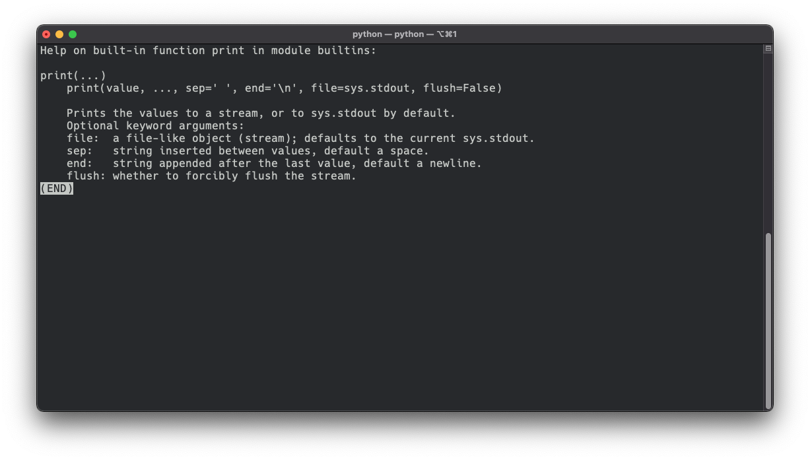

Note: 
To break out of the help response - and here we have the print help,
type a `q`.

--

<!-- .slide: data-auto-animate -->
help for the list function

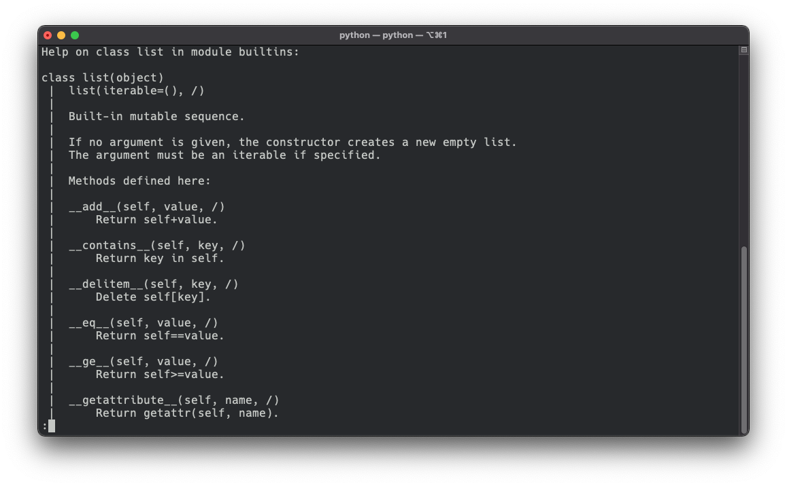

Note: Some methods have longer help documents - to access the rest hit the space bar. Or break out completely with `q`.

--

<!-- .slide: data-auto-animate -->
back to the python `>>>` prompt...

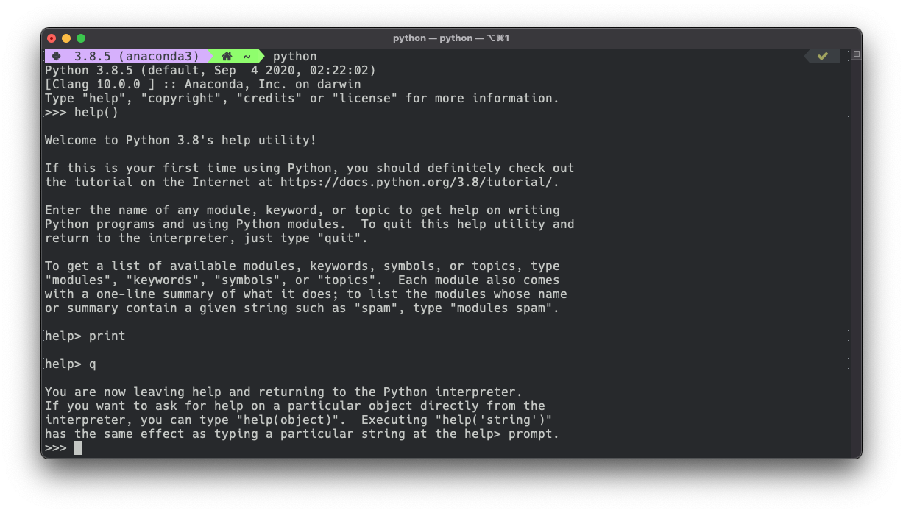

Note: Finally, To exit help, type q for "quit" and then hit the enter key. 
You will be taken back to the Python shell, and you will get the `>>>` prompt.

--

<!-- .slide: data-auto-animate -->
while we are here....

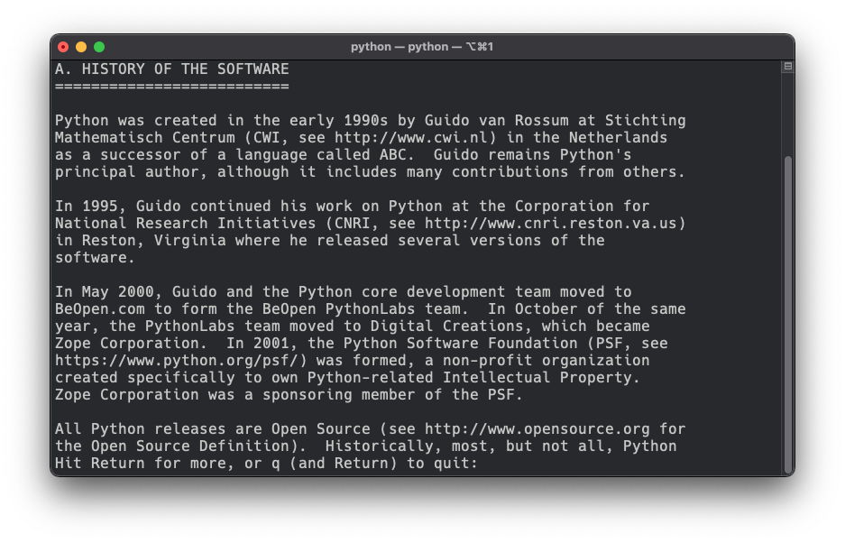

note: we can look at the license - it gives a little bit of the history of the language...
An invention of one man : Guido van Rossum, and it's about 30 years old now

--

help is available in interactive mode...

`>>> help("print")`

Note: Anytime you are at the python prompt, you can get help with
the built in help function and passing the name of a function. 
Don't underestimate the power of this utility...
imagine if you didn't have the internet!!!

--

<!-- .slide: data-auto-animate -->
you can type simple expressions...


Note: check out the big integers in python!!Your calculator will not do this!!

--

<!-- .slide: data-auto-animate -->
secondary prompt for continuation lines...


Note: you can use tab to indent, and return moves to next line...

--

<!-- .slide: data-auto-animate -->
you can write functions...

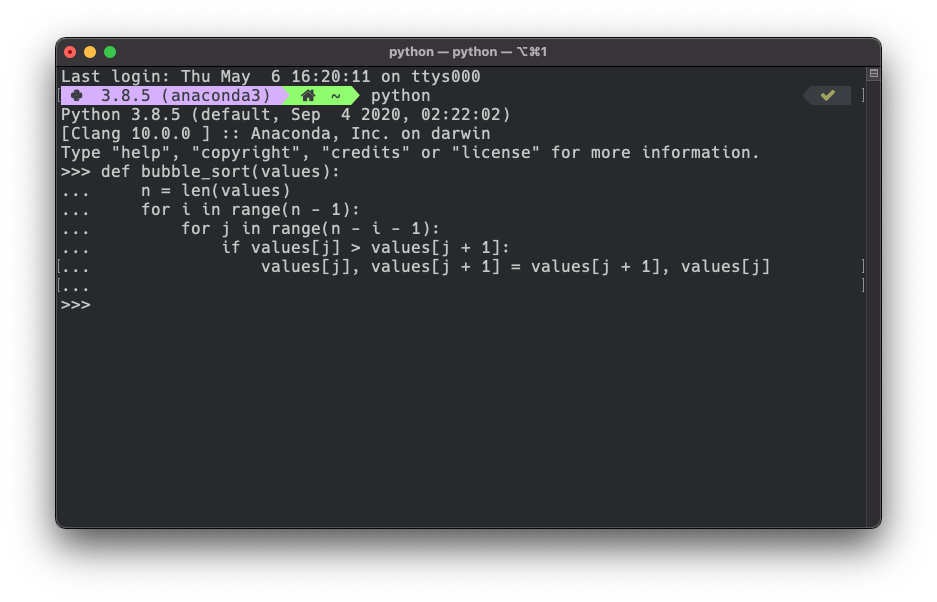

Note: does this one look familiar...

--

<!-- .slide: data-auto-animate -->
create some data...

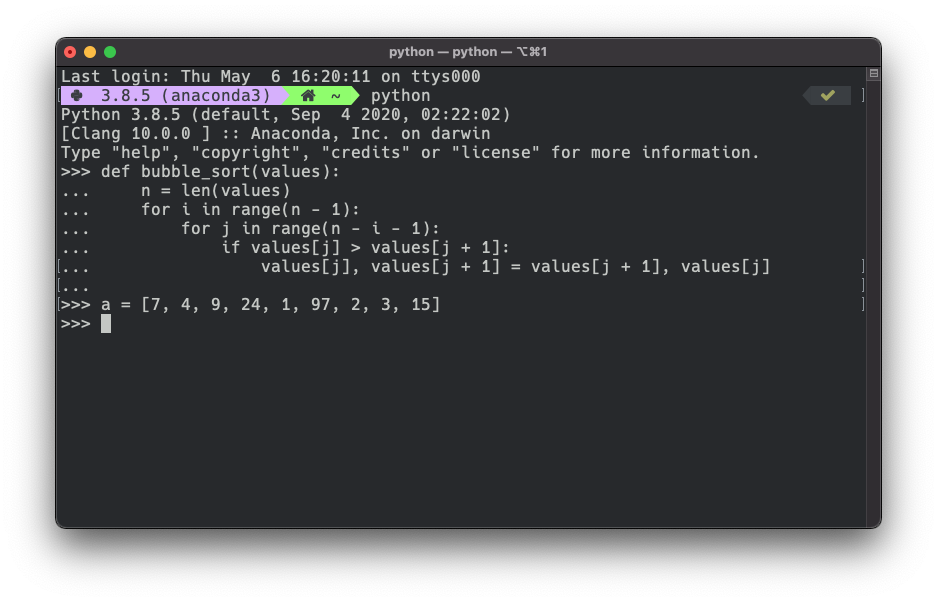

Note: an unsorted list...

--

<!-- .slide: data-auto-animate -->
and run them...

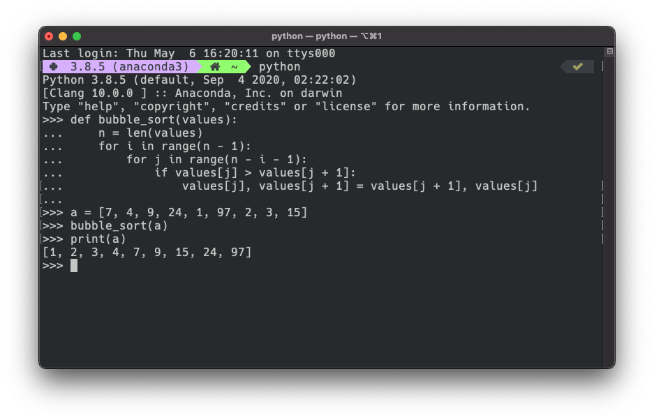

Note: and now it is a sorted list..
The basic python shell is fine when you have only the standard library available.
BUT, you have ipython installed, it comes with anaconda... 

---

# iPython

--

documents:

https://ipython.readthedocs.io/en/stable/

Note: I wont cover installing... but if you need help, ask!

--

The iPython shell is much more powerful,

and enables a number of advanced features.

--

it is the kernel we have used in the `jupyter` environment

--

<!-- .slide: data-auto-animate -->

in your shell, type `ipython`


--

<!-- .slide: data-auto-animate -->
to get back to your prompt, type `CTRL-D` or `CTRL-Z`


Note: you can also use the key press ctrl d or ctrl z
Typing an end-of-file character (Control-D on Unix, Control-Z on Windows)
also = to get back to your system prompt, type `exit()` or `quit()`

--

<!-- .slide: data-auto-animate -->
getting help is just a `?`

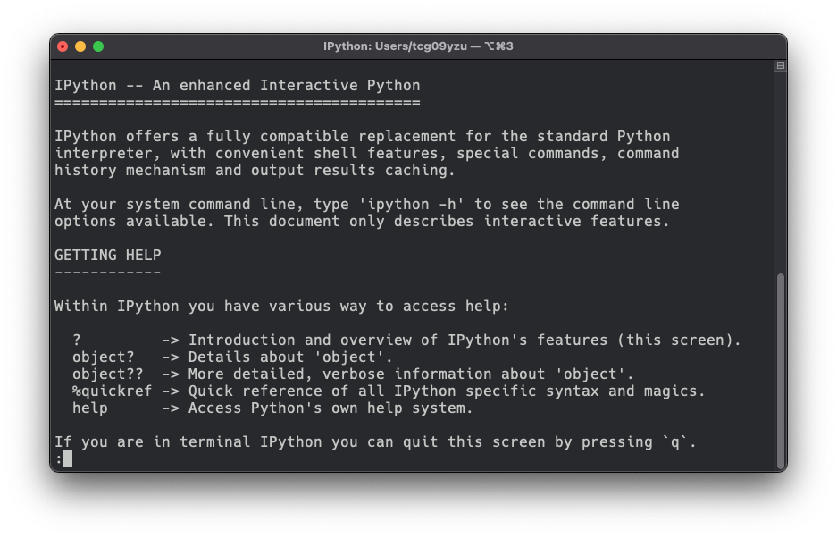

--

<!-- .slide: data-auto-animate -->
you can also type `object?`

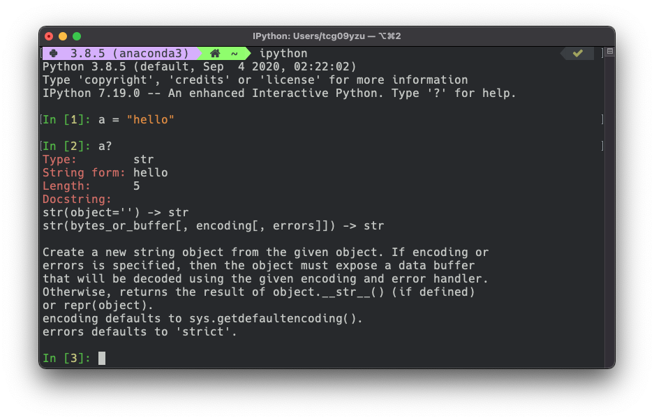

--

<!-- .slide: data-auto-animate -->
you can type simple expressions...


Note: the prompt is numbered...

--

<!-- .slide: data-auto-animate -->
we get syntax highlighting, and completions


--

<!-- .slide: data-auto-animate -->
we also get tab completion, with object awareness...


Note: here, the interpreter is aware data[0] is a string.

I notice a function that is available on the string object - zfill - what does it do? 

--

<!-- .slide: data-auto-animate -->
the `whos` command shows the workspace variables.


--

<!-- .slide: data-auto-animate -->
We can use any shell command by prefixing with `!`

For example, `!ls`, `!pwd`, and `!echo`

note: more on this later

--

<!-- .slide: data-auto-animate -->
It's possible to capture output as a python object.

```python
In [1]: pwd = !pwd

In [2]: pwd
Out[3]: ['/Users/davegreenwood']

```

--

<!-- .slide: data-auto-animate -->
## `%magics`

IPython has a number of commands available specific to and provided by the kernel.

--

<!-- .slide: data-auto-animate -->
## `%lsmagic`

a useful example is `lsmagic` - that lists all the available magics 

--

<!-- .slide: data-auto-animate -->
### `%edit`

launch a file editor and write some code

```python
In [17]: %edit
IPython will make a temporary file named: /var/folders/tmp.py
Editing... done. Executing edited code...
56088
Out[17]: 'a = 123\nb = 456\nx = a*b\nprint(x)\n\n'
```

--

<!-- .slide: data-auto-animate -->
### `%run`

include code from a file and access all its variables

```python
"""run in ipython"""

def bubble_sort(values):
    n = len(values)
    for i in range(n - 1):
        for j in range(n - i - 1):
            if values[j] > values[j + 1]:
                values[j], values[j + 1] = values[j + 1], values[j]

data = [9, 7, 5, 45, 67, 0, -5, 99, 1]

```

note: suppose we have this file, runme.py

--

<!-- .slide: data-auto-animate -->
### `%run`

include code from a file and access all its variables

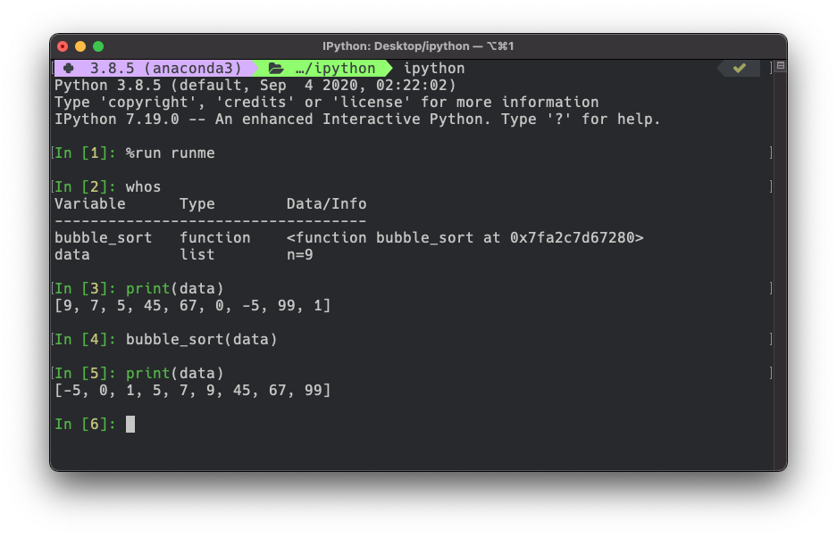

note: here is the result in the console. We can see all the variables in the file with `whos`. Then we can access them in the shell.

--

<!-- .slide: data-auto-animate -->
### `%timeit`

```python
In [19]: %timeit sum(range(100))
1.03 µs ± 16.7 ns per loop (1000000 loops)
```

Note: timeit repeats the operation and reports the average

--

<!-- .slide: data-auto-animate -->
### `%timeit`

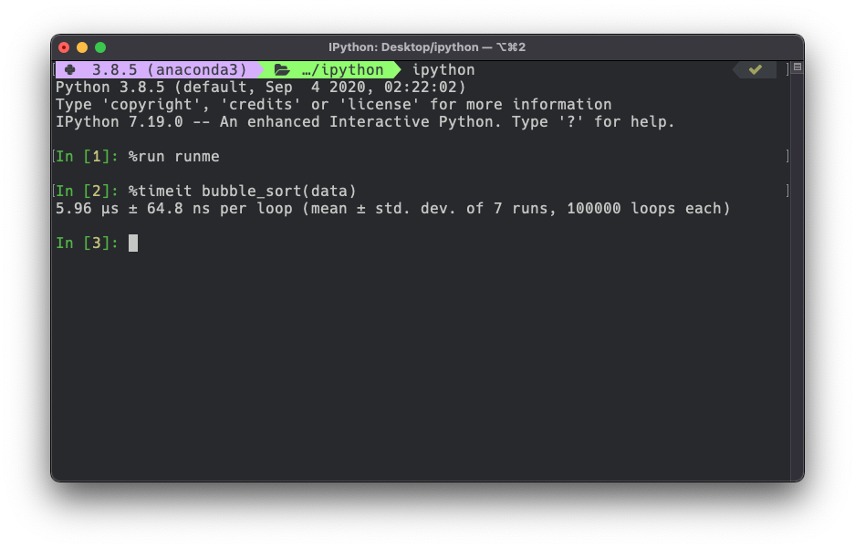

note: it is a slightly different experiment to the labs - perhaps
better suited to comparing two algorithms - rather than estimating time complexity.

--


<!-- .slide: data-auto-animate -->
### `%timeit`

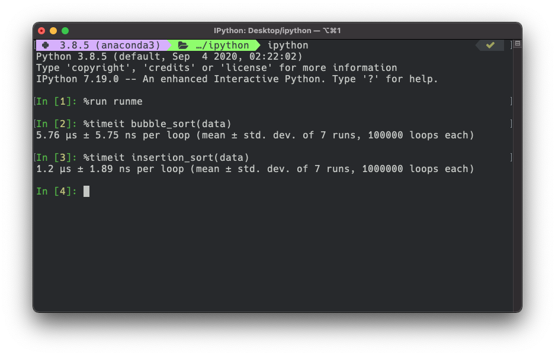

note: here we compare the runtime on my machine, of bubble and insertion sort. These algorithms both have the same time complexity but insertion is faster. WHY?

--

### `%matplotlib`

```python
In [1]: %matplotlib
Using matplotlib backend: MacOSX

In [2]: import numpy as np
In [3]: import matplotlib.pyplot as plt

In [4]: x = np.linspace(0, 2*np.pi, 1000)
In [5]: y = np.sin(x)

In [6]: plt.plot(x, y)
Out[7]: [<matplotlib.lines.Line2D at 0x7ffa481b65e0>]

```

--


Note: Gives interactive plotting to the console, but 
I recommend the jupyter environment for this purpose.

However this does give you an interactive plot window, for zooming, cropping and saving.

---

## Conclusion

Python **Shell** or *REPL*
<!-- .element: class="fragment" -->
**iPython** shell
<!-- .element: class="fragment" -->
